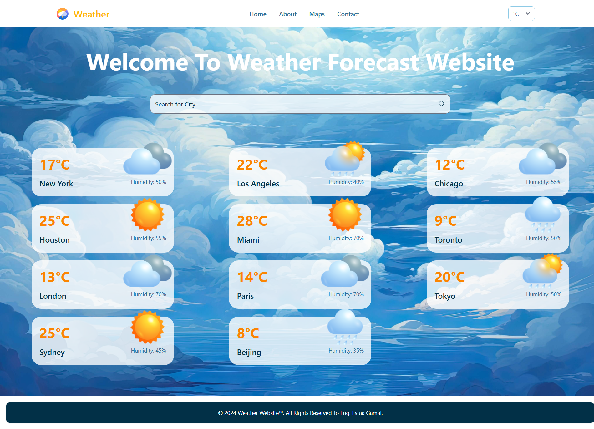
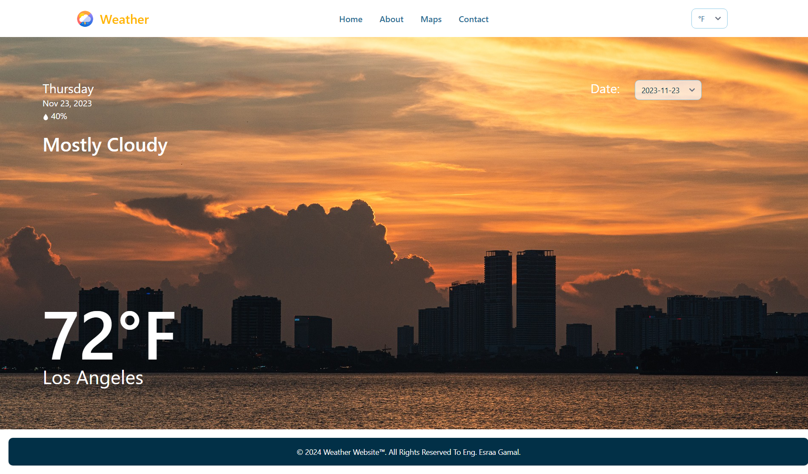

# WeatherProject

This project was generated with [Angular CLI](https://github.com/angular/angular-cli) version 18.1.3. This project is a web application that provides weather forecasts for various cities. It is built using the Angular framework for the front end, styled with Tailwind CSS, and powered by an Express.js backend API. The application demonstrates a seamless integration of modern front-end and back-end technologies to deliver real-time weather data.

## Development server

Run `ng serve` for a dev server. Navigate to `http://localhost:4200/`. The application will automatically reload if you change any of the source files.

## Screenshots

---

---

## Code scaffolding

Run `ng generate component component-name` to generate a new component. You can also use `ng generate directive|pipe|service|class|guard|interface|enum|module`.

## Build

Run `ng build` to build the project. The build artifacts will be stored in the `dist/` directory.

## Running unit tests

Run `ng test` to execute the unit tests via [Karma](https://karma-runner.github.io).

## Running end-to-end tests

Run `ng e2e` to execute the end-to-end tests via a platform of your choice. To use this command, you need to first add a package that implements end-to-end testing capabilities.

## Contact

- GitHub: [Esraa-GamalH](https://github.com/Esraa-GamalH)
- Email: esr.gamal@nu.edu.eg
